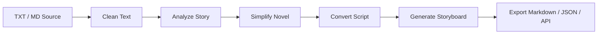

# ComicDrama Creator Workflow

ComicDrama Creator Workflow is an open toolkit for adapting legally owned novels into comic-drama development assets: simplified novels, character and scene extraction, narration scripts, Hollywood-style scripts, and storyboard tables.

The project is designed for two audiences:

- Individual creators who need a repeatable novel-to-comic-drama workflow.
- Teams and enterprises that want to embed the workflow into existing content production, review, asset, or AI generation systems.

## Author Note

The original project concept comes from a creator with 22 years of film, television, novel, screenplay, and full-cycle production experience, now focused on AI comic-drama and original AI film development.

Sample novels, scripts, and cases included with this repository are for feature testing and learning only. They may not be copied, redistributed, commercially used, used for model training, or adapted into derivative production without explicit permission from the rights holder.

## Features

- Source import: paste text or upload TXT, Markdown, and selectable-text PDF files.
- Novel simplification: compress long source text while preserving the core plot, conflicts, and relationships.
- Element extraction: identify candidate characters, locations, props, and story beats.
- Script conversion: generate comic narration format or Hollywood-style script blocks.
- Storyboard draft: turn script blocks into shot rows with visual prompts.
- Batch-friendly CLI: run the workflow from shell scripts or CI jobs.
- Enterprise API: FastAPI endpoints for workflow orchestration and platform embedding.
- Prompt templates and JSON schemas: keep prompts and integration contracts editable outside source code.
- Copyright gate: processing requires explicit rights confirmation.

## Quick Start

```bash
python3 -m venv .venv
source .venv/bin/activate
pip install -e ".[dev]"

comicdrama run examples/sample-novel.md \
  --config examples/sample-config.json \
  --confirm-rights \
  --format markdown \
  --output examples/outputs/sample-workflow.md
```

Run the API:

```bash
PYTHONPATH=src python3 -m uvicorn comicdrama.api.app:app --reload
```

Open `http://127.0.0.1:8000/` for the browser workbench, or `http://127.0.0.1:8000/docs` for the interactive API console.

## CLI Examples

```bash
comicdrama simplify examples/sample-novel.md --confirm-rights --format markdown
comicdrama extract examples/sample-novel.md --format json
comicdrama script examples/sample-novel.md --confirm-rights --target-format hollywood
```

## API Endpoints

- `GET /health`
- `POST /api/v1/files/extract-text`
- `POST /api/v1/novel/analyze`
- `POST /api/v1/novel/simplify`
- `POST /api/v1/script/convert`
- `POST /api/v1/workflows/comicdrama`

Minimal request:

```json
{
  "document": {
    "title": "Demo Novel",
    "source_format": "md",
    "text": "Chapter text..."
  },
  "config": {
    "style": "chinese",
    "target_format": "comic_narration",
    "dialogue_retention_ratio": 0.8,
    "narration_pov": "third_person",
    "storyboard_detail": "medium",
    "copyright_confirmation": true
  }
}
```

## Workflow



## Project Structure

```text
src/comicdrama/
  core/        # data models, text cleaning, processor, exporters
  api/         # FastAPI app
  cli.py       # argparse CLI
prompts/       # editable prompt templates for future LLM providers
schemas/       # JSON schemas for enterprise integration contracts
examples/      # sample input, config, and generated outputs
docs/          # workflow, API, copyright, and integration guides
```

## Licensing

Code is licensed under Apache-2.0.

Sample works, original novels, scripts, screenplay excerpts, and case materials are all rights reserved unless a separate license is provided.

See `LICENSE` and `NOTICE.md`.
